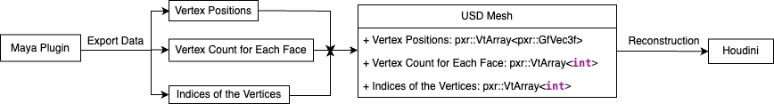
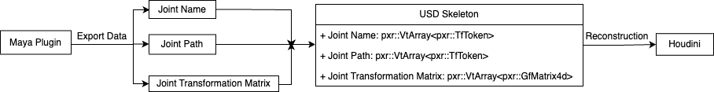
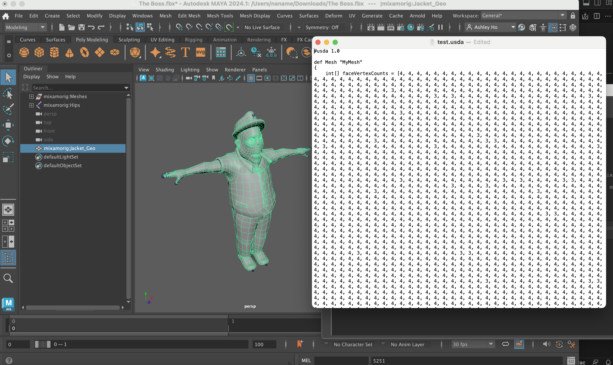
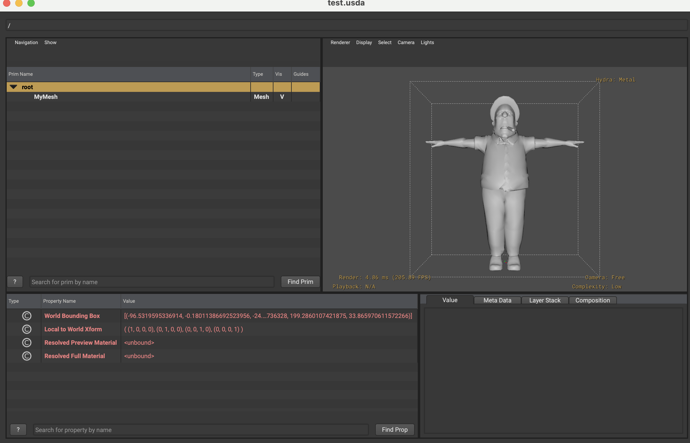
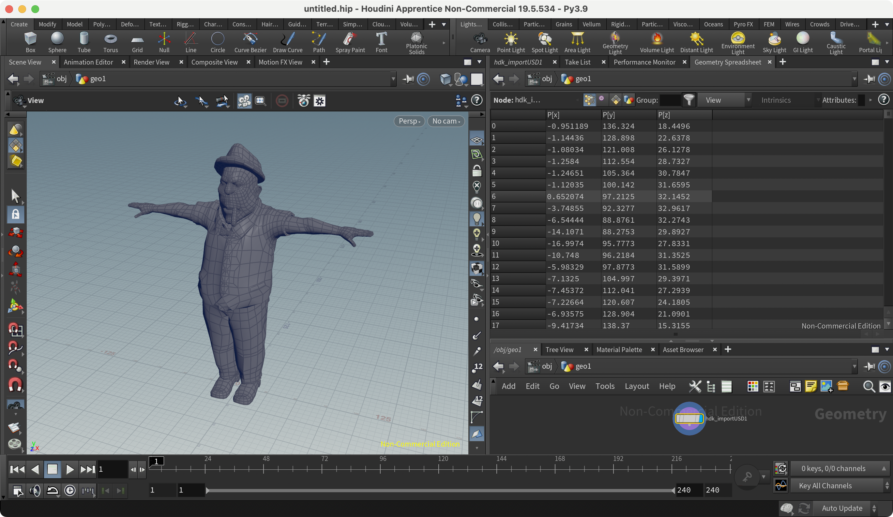
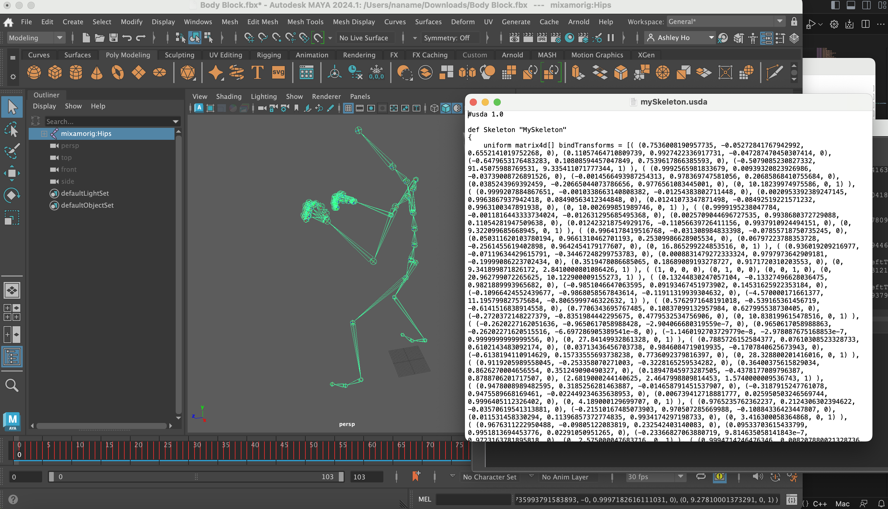
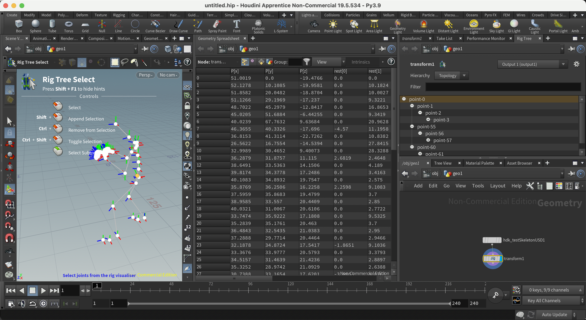

# Maya-Houdini USD Rigging Schema for Streamlined Animation Workflow

## Overall Idea ([video](https://vimeo.com/853499503?share=copy))
### abstract
This project presents an innovative approach for transferring mesh and skeleton data from Maya to Houdini using the Universal Scene Description (USD) format, providing a supplementary method to the traditional FBX and ABC data transfer processes. Initially, two plugins were developed using the C++ Maya API, designed to extract mesh and skeleton information from Maya. This data was then converted with the USD API and exported in a USD format. For importing this data into Houdini, two additional plugins were developed utilizing C++ Houdini Development Kit (HDK), converting the USD data into a format that Houdini can recognize and display. In essence, this project explores an alternative avenue for data exchange between Maya and Houdini, contributing to the diversification of data transfer methodologies in the 3D animation industry.

### Data Design
#### Mesh Information Design

- Vertex Positions: These are the three-dimensional coordinates (x, y, z) that define the shape of a mesh. They impact how the mesh looks, interacts with light, shadows, and other scene elements.
- Vertex Count for Each Face: This list tells us how many vertices make up each face in a mesh. Triangles have 3 vertices, quads have 4. Sometimes faces have more than 4 vertices, called n-gons. Keeping track of these counts is essential for accurately reconstructing the mesh in software.
- Indices of the Vertices: This structured array defines the order of connecting vertices to create faces. It's like a roadmap for constructing polygons. This indexed approach is efficient for storing complex meshes. If a vertex is shared by multiple polygons, its position is saved only once, reducing redundancy and improving processing speed. This indexing is crucial for optimizing 3D mesh storage and computation.

#### Skeleton Information Design

- Joint Name: Each bone or joint in a rig has a unique name, crucial for identification, scripting, animation, and accurate data transfer between software.
- Joint Path: Joints form a hierarchy in skeletal animation. A joint's full path defines its position within this hierarchy. This structure ensures that transformations applied to parent joints affect all descendants. Preserving the path hierarchy maintains deformation and animation integrity.
- Joint Transformation Matrix: In software like Autodesk Maya, a joint's transformation matrix holds its position, rotation, and scale relative to its parent. Preserving this matrix during data transfer maintains spatial orientation accurately. Transmitting the matrix is more efficient and precise than decomposing and sending individual transformation components.

### Plugin Framework
#### Maya Plugin Framework with Maya API
Set up a precise C++ environment for Maya Houdini --> Link Maya build-in USD libraries and Maya libraries in "CMakeLists.txt" --> Choose ".bundle" output format for macOS, bundling code and enhancing distribution. --> Headers included Maya and USD, with a custom MEL command. --> 'doIt' function hold core plugin logic.

#### Houdini Plugin Framework with Houdini HDK
Set up a precise C++ environment for Houdini plugin --> Link Houdini build-in USD libraries and Houdini HDK toolkit in "CMakeLists.txt" --> Generate embedded DS file for specifying the parameter interface. --> 'cook' function hold core plugin logic. --> Used CMake and "hcustom" to generate plugin library for Houdini.

## Development Environment
### Maya plugin 

- build system generator: CMake
- build system: Ninja
- compiler: Clang 14.0.0 arm64-apple-darwin22.1.0
- Integrated Development Environment (IDE): Visual Studio Code
- C++ libraries:
  - maya_2024
  - USD (maya_2024 built in usd)
  - python3.10

### Houdini plugin

- build system generator: CMake 3.26.4
- build system: Unix Makefiles
- compiler: Xcode
- Integrated Development Environment (IDE): Visual Studio Code
- C++ libraries:
  - houdini_19.5
  - USD (houdini_19.5 built in usd)
  - python3.9

## Result
### Mesh
Test complex polygon (left) and after converting USD file (right)

USD view with complex polygon

Test complex polygons shown in Houdini interface using USD import plugin 

### Skeleton
Test complex skeleton (left) and after converting USD file (right)

Test complex skeleton shown in Houdini interface using USD import plugin

